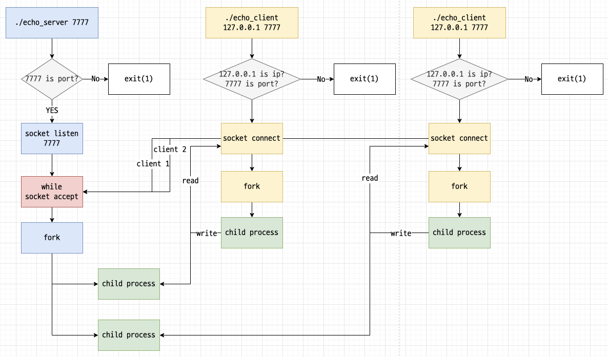
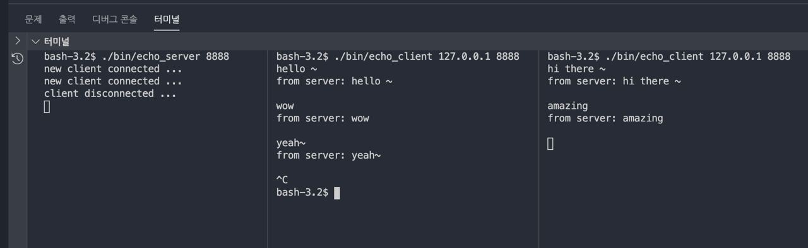

# echo_chat
에코 서버

## multiprocess echo server
내부 동작 흐름도  

동작중 스크린샷  

### how to use
#### echo_server
```
./echo_server <port>
```
#### echo_client
```
./echo_client <ip> <port>
```
### compile
#### echo_server
```
cd multiprocess_server
cc echo_server.c -o echo_server
```
#### echo_client
```
cd multiprocess_server
cc echo_client.c -o echo_client
```